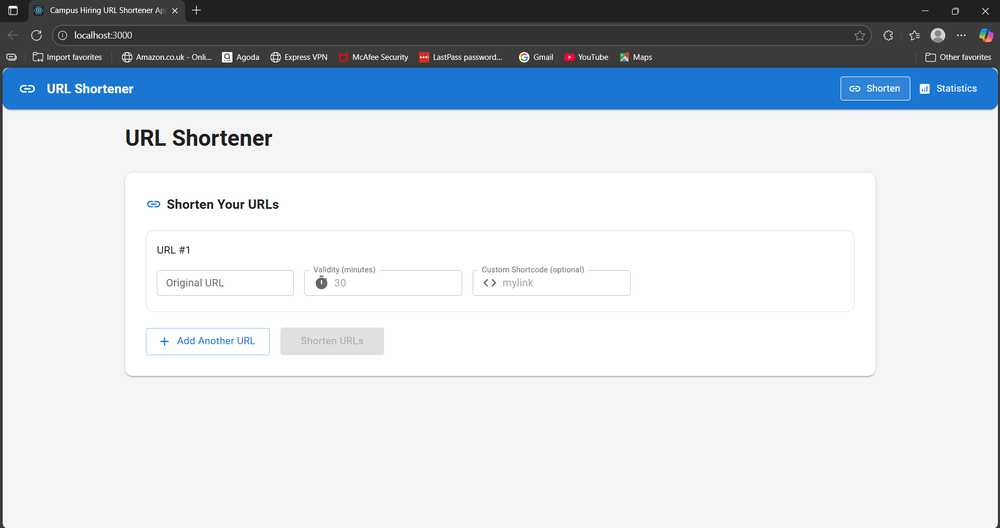
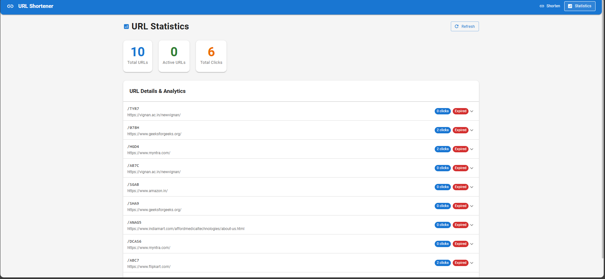

# Affordmed URL Shortener

A simple URL shortener built with **React, Vite, TypeScript, and Material UI**.  
It allows shortening multiple URLs, adding custom short codes, setting expiry time, and tracking clicks.



---

## Features
- Shorten up to **5 URLs at once**
- **Custom short codes** (auto-generated if empty)
- **Default expiry** of 30 minutes if not provided
- **Redirects** using short code (/:code)
- **Click tracking** with time, referrer, and timezone
- **Statistics page** to view URLs and their click counts
- **Logs stored in localStorage**
- UI built only with **Material UI**

---

## Installation

```bash
# Install dependencies
npm install

# Start development server
npm run dev


